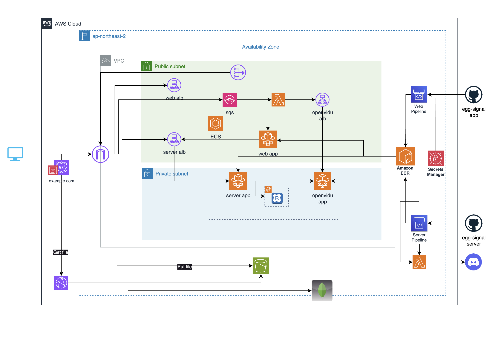

## Egg-Signal infra repository

### Architecture

All Resources are defined as AWS Cloudformation code

You can deploy all resources automatically, if you fill the config.json file with valid values

### If you want to deploy manually
Create s3, upload the templates folder files, and then deploy through the cloudformation console (the config.json file is not needed in this case).

### Otherwise, if you want to deploy it automatically
You can create a code pipeline that subscribes to the infra repository and run the cloudformation file through the pipeline. (In this case, a config.json file is needed.)
